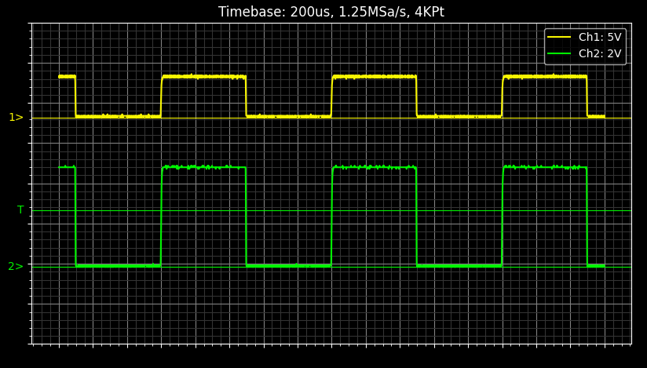
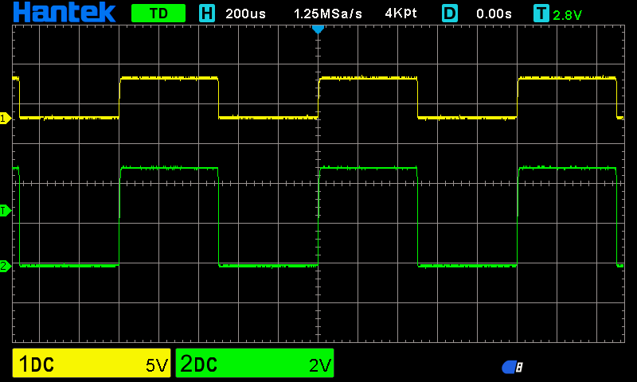

# Hantek Wave Viewer

This project aims to reverse engineer the Hantek `lwf` file format. I couldn't find any documentation for the format or previous projects so created this one by reverse engineering samples. I hope it works for you.

**Note:** All tests conducted on a Hantek DSO2C10

## Kaitai Struct

In the `kaitai` directory there is a [Kaitai Struct](https://www.kaitai.io) file which describes the structure of the file. As mentioned above this is based on me reverse engineering and may not be 100% accurate; there are also bytes I haven't yet identified.

This file can be used to build bindings for other languages. To generate the currently supported Python and C++ files you can run `./generate.sh` from the project root directory.

I captured a number of wavefiles with known parameters, all files used are in `wavefiles`. You can read more about each sample in `wavefiles/README.md`

## Python

The sample Python allows you to view the `lwf` file using `matplotlib` or to simply describe the file and it's content

### Installation

```bash
git clone https://github.com/mattdavis90/hantek-wave-viewer.git
cd hantek-wave-viewer/python
pip install .
```

### Usage

To display information about an `lwf` file

```bash
> hantek_wave_viewer info <lwf_file>
Hantek Wave Viewer: v0.1.0
Common:
        Version: 2001
        Acquisition Mode: Normal [0]
        Timebase: 500us [16]
        Sampling Depth: 4000
        Samples per Second: 500000.0
        Trigger Type: UART [9]
        Trigger Channel: 0
        Trigger Level: 0
        Horizontal Offset: 0
Channel 1
        Sample Count: 4000
        Offset: 24
        Vots per Division: 2V [11]
        Probe Mode: 1x [0]
Channel 2
        Disabled
Channel 3
        Disabled
Channel 4
        Disabled
Data:
        Channel 1: 4000
        Channel 2: 0
        Channel 3: 0
        Channel 4: 0
```

To view the file using `matplotlib`

``` bash
hantek_wave_viewer view <lwf_file>
```


### Screenshots

This is a screenshot of the Python based viewer



and the same waves on the Oscilloscope for comparison




## C++

The C++ example has the same `info` command as the Python application and will output in the same format. This examples also has a converter that will output a [vcd file](https://en.wikipedia.org/wiki/Value_change_dump) which can be used in GTKWave or Sigrok.

### Building

```bash
git clone https://github.com/mattdavis90/hantek-wave-viewer.git
cd hantek-wave-viewer/cpp
mkdir build
cd build
cmake ..
make
```

### Usage

To output information about the `lwf` file

```bash
./hantek info <lwf_file>
```

To convert the file into a `vcd`

```bash
./hantek vcd <lwf_file> <vcd_output>
```

## Other Programming Languages

This project is licensed as MIT so feel free to use and modify as you wish. The Kaitai file is included and, as per their docs, could be used to generate a parser in other languages.
